<a name="top"></a>
### Git Setup Tutorial
---

| [Github Collaboration](Git-Collaboration.md) | [Github Branch](Git-Branch.md)
--
<br>

**Table Content** 
- [Git Setup](#setup)
- [Creating a Repoistory](#repo)
- [Forking a Repoistory](#fork)
- [Clonning a Repoistory](#clone)
- [Requesting Pull Request](#pull)

<br>

#### In this tutorial we are learn how to download, install & setup Git software? & how to connect Git remotely with GitHub Repoistory & also learn about forking, clonning and pull requests?

**At the heart of GitHub is an open source version control system (VCS) called Git. Git is responsible for everything GitHub-related that happens locally on your computer.**

<a name="setup"></a>
## Install Git on Windows

1. Download the Git Software [Git Download](https://gitforwindows.org/)<br><br>
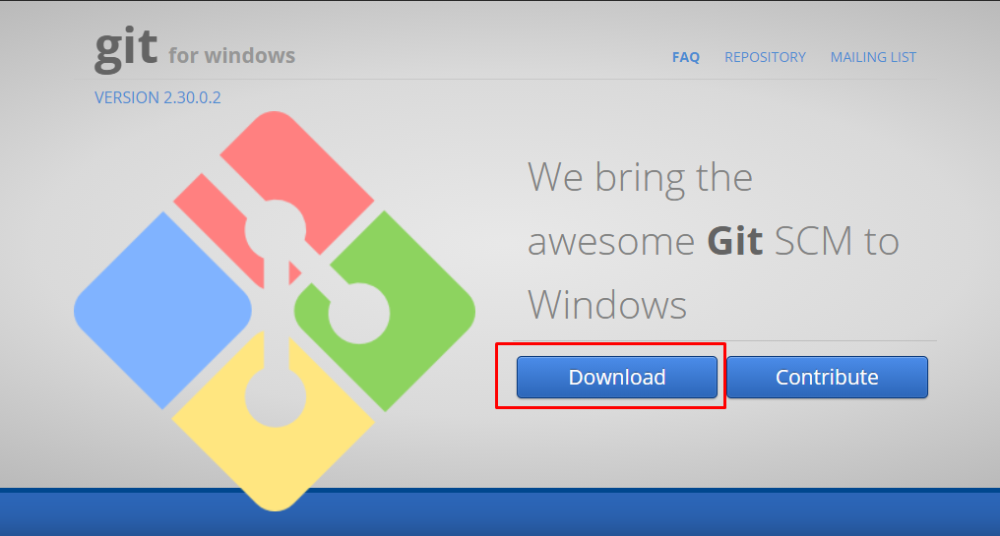 <br><br>

1. When you've successfully started the installer, you should see the **Git Setup** wizard screen. Follow the **Next** and **Finish** prompts to complete the installation. The default options are pretty sensible for most users. <br><br>

1. After complete the installation, Open ```Git Bash``` from search bar.<br><br>
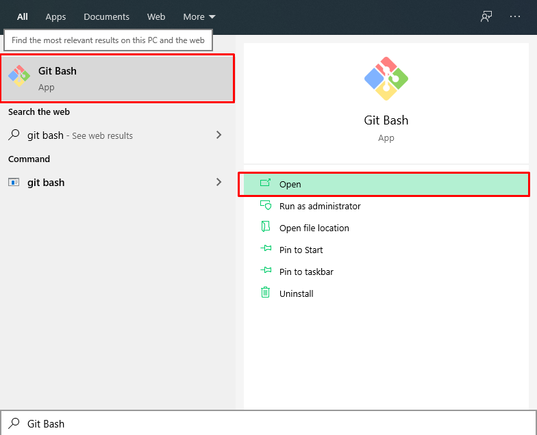 <br><br>

1. Configuration your ```Git``` **Username** & **Email** using the following commands. These details will be associated with any commits that you create. 
```bash
$ git config --global user.name "Devansh Sharma"
$ git config --global user.email "ds225@njit.edu"
```

1. Configrure to **Store** & **Cache** ```Git``` credential information (for avoiding to enter again & again credential details)
```bash
$ git config --global credential.helper store
$ git config --global credential.helper cache
```

<a name="repo"></a>
## Create a Repository
**To put your project up on GitHub, you'll need to create a repository for it to live in.**

1. Login or Signup [Github](https://github.com/) Account.
1. In the upper-right corner of any page, use the ```+``` drop-down menu, and select **New repository**.<br><br>
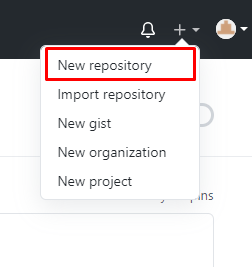<br><br>
1. Type a unique & short, memorable name for your repository. For example, "New-Repo".<br><br>
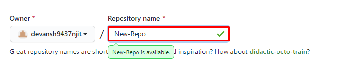<br><br>
1. Type short description of "New-Repo", Select ```Public``` option & ignore all check options [Optional].<br><br>
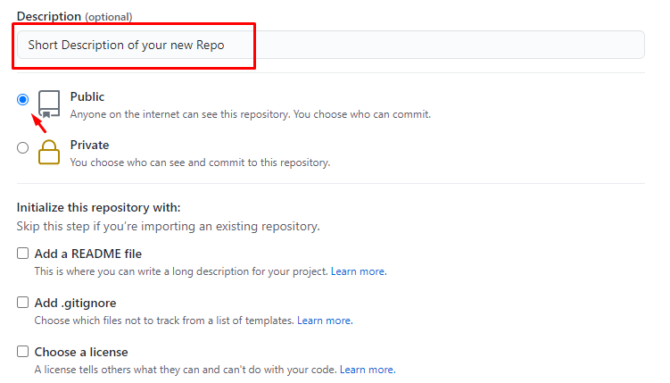<br><br>
1. Click on **Create Repoistory** button.


<a name="fork"></a>
## Fork a Repository
A **fork** is a copy of a repository. Forking a repository allows you to freely experiment with changes without affecting the original project.
> Most commonly, forks are used to either propose changes to someone else's project or to use someone else's project as a starting point for your own idea.

#### Propose changes to someone else's project
For example, you can use forks to propose changes related to fixing a bug. Rather than logging an issue for a bug you've found, you can:

 - Fork the repository.
 - Make the fix.
 - Submit a pull request to the project owner.
 
#### Fork an example repository
1. On GitHub, navigate to the [octocat/Spoon-Knife](https://github.com/octocat/Spoon-Knife) repository.
1. In the top right corner of the page, click **fork**.<br>
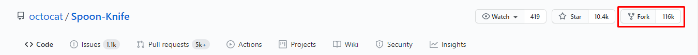<br><br>

forking the repo is successfully completed. now Keep your fork sync regularly. For regularly sync we clone this repo on our local pc.

<a name="clone"></a>
## Clonning a Repoistory

If you haven't yet, you should first [set up Git](#setup). Don't forget to set up authentication to GitHub from Git as well.

> **Create a local clone of your fork**<br>

Right now, you have a fork of the Spoon-Knife repository, but you don't have the files in that repository on your computer. Let's create a **clone** of your fork locally on your computer.

1. On GitHub, navigate to your fork of the ```Spoon-Knife``` repository.
1. Above the list of files, click **⬇ Code** , Select ```HTTPS``` option and click on 📋 icon to copy the repo clone link.<br> 
<br><br>
1. Open ```Git Bash```
1. Change the current working directory to the location where you want the cloned directory.
1. Type ```git clone```, and then paste the URL you copied earlier. It will look like this, with your GitHub username instead of ```YOUR-USERNAME```:
```bash
$ git clone https://github.com/devansh9437njit/Spoon-Knife.git
```
Now, you have a local copy of your fork of the Spoon-Knife repository.<br><br>


> **Configure Git to sync your fork with the original Spoon-Knife repository**<br>

When you fork a project in order to propose changes to the original repository, you can configure Git to pull changes from the original, or upstream, repository into the local clone of your fork.

1. On GitHub, navigate to the [octocat/Spoon-Knife](https://github.com/octocat/Spoon-Knife) repository.
1. Above the list of files, click **⬇ Code** , Select ```HTTPS``` option and click on 📋 icon to copy the repo clone link.<br> 
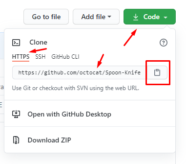<br><br>
1. Open ```Git Bash```
1. Go to your repo directory.
1. Type ```git remote -v``` and press Enter. You'll see the current configured remote repository for your fork.<br>
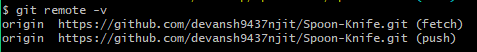<br><br>
1. Type ```git remote add upstream```, and then paste the URL you copied in Step 2 and press Enter. It will look like this:
```bash
$ git remote add upstream https://github.com/octocat/Spoon-Knife.git
```
1. To verify the new upstream repository you've specified for your fork, type ```git remote -v``` again. You should see the URL for your fork as ```origin```, and the URL for the original repository as ```upstream```.<br>
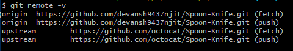<br><br>

Now, you can keep your fork synced with the upstream repository with a few Git commands. 

If you are hoping to contribute back to the original repository, you can send a request to the original author to pull your fork into their repository by submitting a pull request.


<a name="pull"></a>
## Requesting Pull Request

1. Before pull request push your code to server using following command
```bash
$ git push -u origin main
```

1. Go to ```GitHub``` and select repoistory which you want to requesting for pull request.
1. Click on ```Pull requests``` tab.<br>
<br><br>
1. Click on ```click pull request```.<br>
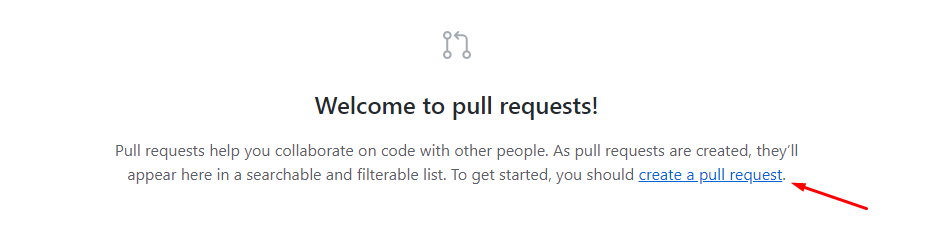<br><br>
1. ```✔ able to marge``` then click on ```create pull request```.<br>
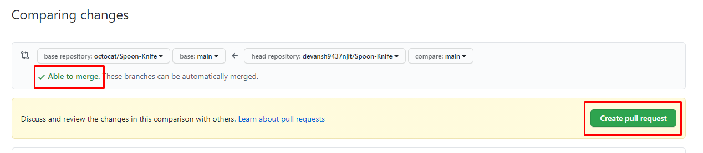<br><br>
1. Type ```Commit``` & click on ```create pull request```.<br>
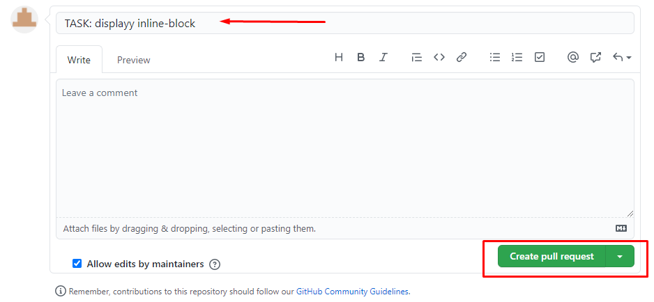<br><br>

**Pull Requests has successfully Open.**<br>
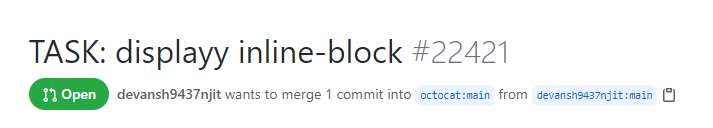<br><br>

[goto top](#top)
___
([ README.md ](../../README.md))