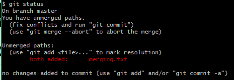
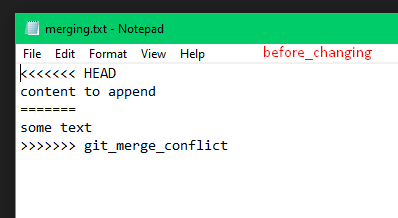
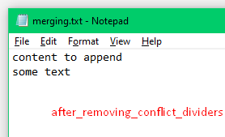

<a name="top"></a>
### Git Branch Tutorial
---

[Go to GitHub Collaboration](Git-Collaboration.md)
--
<br>

**Table of Contents** 
- [Git Branch](#branch)
- [Merge Branches](#merge)
- [Create Merge Conflict](#merge-conflict)
- [Resolve Merge Conflict](#merge-conflict-resolve)

<br>

#### In this tutorial we will learn how to create branches, create merge conflict & how resolve them

**The implementation behind Git branches is much more lightweight than other version control system models. Instead of copying files from directory to directory, Git stores a branch as a reference to a commit. In this sense, a branch represents the tip of a series of commits. The history for a branch is extrapolated through the commit relationships.**

<a name="branch"></a>
## Git Branch

#### Create new branch without to ```checkout```
Type following code line in ```Git Bash```.
```
$ git branch <branch-name>
```

#### Create new branch with ```checkout```
Type following code line in ```Git Bash```.
```
$ git checkout -b <branch-name>
```

#### Git Checkout
Type following code line in ```Git Bash``` for ```checkout``` into branch.
```
$ git checkout <branch-name>
```

#### Delete branch
Type following code line in ```Git Bash``` to delete existing branch.
```
$ git branch -d <branch-name>
```

<font color=red>Note: don't use angle bracket in ```Git Bash``` when you attempt any given command.</font>

<a name="merge"></a>
## Merge Branches
The ```git merge``` command lets you take the independent lines of development created by git branch and integrate them into a single branch.

<font color=red>Before performing a merge there are a few steps to take to ensure it goes smoothly.</font>

#### Confirm the receiving branch
Execute ```git status``` to ensure that ```HEAD``` is pointing to the correct merge-receiving branch. If needed, execute ```git checkout``` to switch to the receiving branch. In our case we will execute ```git checkout master```.

#### Fetch latest remote commits
Make sure the **receiving branch** and the **merging branch** are up-to-date with the latest remote changes. Execute ```git fetch``` to **pull** the latest remote commits. 

Once the fetch is completed ensure the master branch has the latest updates by executing ```git pull```.

```
$ git merge <branch-name>
```

**Example** 
```bash
# Start a new feature
$ git checkout -b feature master

#Edit some files, add & commit
$ git add .
$ git commit -m "New features added"

# Merge feature branch
$ git checkout master
$ git merge feature

# now delete feature branch
$ git branch -d feature
```
<a name="merge-conflict"></a>
## Create Merge Conflict
In order to get real familiar with merge conflicts, the next section will simulate a conflict to later examine and resolve.

```bash
# create new directory for repo & go to new directory
$ mkdir git-merge
$ cd git-merge
$ git init

# make a new file & add some content inside using echo command
$ echo "this is some content" > merging.txt
$ git add merging.txt
$ git commit -m "we are commiting merging.txt"
```
Now we have a new repo with one branch ```master``` and a file ```merging.txt``` with content in it. Next, we will create a new branch to use as the conflicting merge.

```bash
$ git checkout -b git_merge_conflict
$ echo "different content to merge later" > merging.txt
$ git commit -m "edited the content of merging.txt to cause a conflict"
```
overwrite the content in ```merging.txt```

With this new branch: ```git_merge_conflict``` we have created a commit that overrides the content of ```merging.txt```
```bash
$ git checkout master
$ echo "append contect" >> merging.txt
$ git commit -m "append content to merging.txt"
```

This chain of commands checks out the ```master``` branch, appends content to ```merging.txt```, and commits it. This now puts our example repo in a state where we have 2 new commits. One in the master branch and one in the git_merge_conflict branch. At this time lets git merge git_merge_conflict and see what happen!
```bash
$ git merge git_merge_conflict
```
ERROR: <br>


<a name="merge-conflict-resolve"></a>
## Resolve Merge Conflict
As we have experienced from the proceeding example, Git will produce some descriptive output letting us know that a CONFLICT has occcured. We can gain further insight by running the ```git status``` command.



Here we have used the ```cat``` command to put out the contents of the merging.txt file. We can see some strange new additions

- <<<<<<< HEAD
- =======
- \>>>>>>> git_merge_conflict<br>


Think of these new lines as "conflict dividers". The ```======= line``` is the "center" of the conflict. All the content between the center and the ```<<<<<<< HEAD``` line is content that exists in the current branch master which the HEAD ref is pointing to. Alternatively all content between the center and ```>>>>>>> git_merge_conflict``` is content that is present in our merging branch

#### Solve this issue
The most direct way to resolve a merge conflict is to edit the conflicted file. Open the ```merging.txt``` file in your favorite editor. For our example lets simply remove all the conflict dividers. The modified ```merging.txt``` content should then look like:<br>

<br><br>
Once the file has been edited use ```git add merging.txt``` to stage the new merged content. To finalize the merge create a new commit by executing:
```bash
$ git commit -m "Merged and resolved the conflict"
```
Git will see that the conflict has been resolved and creates a new merge commit to finalize the merge.

[go to top](#top)
___

([ README.md ](../../README.md))
