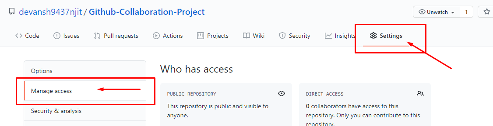
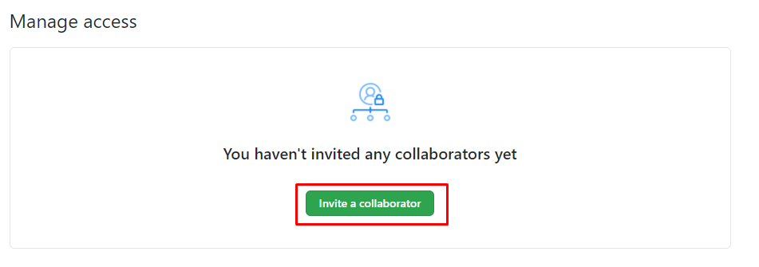
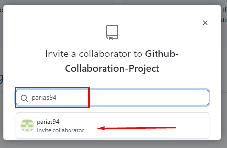
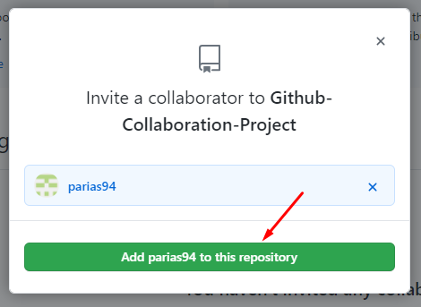
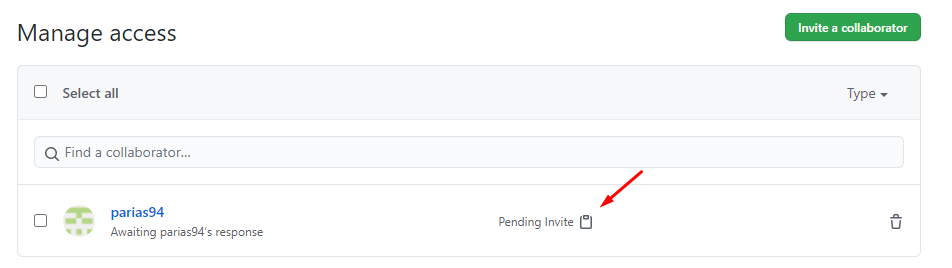

<a name="top"></a>
### Git Collaboration Tutorial
---

[Go to Github Branch](Git-Branch.md)
--

#### In this tutorial we will learn how to send a collaboration request

**GitHub** has become the cornerstone for all things open source software. Developers love it, collaborate on it and are constantly building awesome projects through it. Apart from hosting our code, GitHub's main attraction is using it as a collaborative tool.

## Add Team Member

1. Go to Github & select the repo where you want to add a team member for collaboration.
1. Click on **Setting** and goto **Manage Access** Tab.<br>
 <br><br>
1. Click on the **Invite a collaborator** button under the Manage Access area.<br>
<br><br>
1. Search for the collaborator by using the ```username```, ```email``` address & ```Full Name``` and select user under the search results.<br>
<br><br>
1. Click on the **Add** Button.<br>
<br><br>
1. After Adding the collaborator then click the invitation link & send to collaborator or team member.<br>
<br><br>
1. When you send the collaboration link to team member, they will see the notification to **accept** or **decline** the invitation.<br>
<br></br>

Now they can push source code to this repo.

[go to top](#top)
___
([ README.md ](../../README.md))
